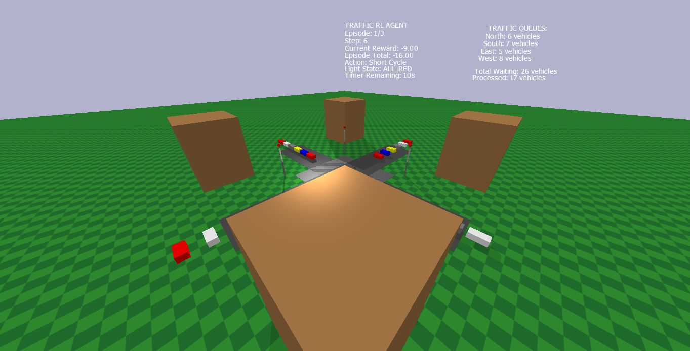

# 🚦 Rwanda Traffic Junction - Reinforcement Learning Optimization System

This project develops and evaluates reinforcement learning agents for intelligent traffic light control at busy junctions in Rwanda. Through comprehensive experimentation with 4 different RL algorithms and 17 distinct configurations, we demonstrate that AI agents can significantly outperform traditional traffic management methods.



**Mission: Replace road wardens with intelligent agents** - A comprehensive reinforcement learning study to optimize traffic flow at busy junctions in Rwanda using state-of-the-art RL algorithms.


### Real-World Impact
- **Location**: Kigali, Rwanda traffic junctions
- **Problem**: Inefficient manual traffic management by road wardens
- **Solution**: Intelligent RL agents for automated traffic optimization
- **Achievement**: **+74.7% improvement** over random baseline with PPO

## Key Achievements

### **Best Performance: PPO_AGGRESSIVE**
- **Reward**: -151.85 ± 34.2
- **Improvement**: +74.7% over random baseline
- **Classification**: **ELITE TIER** performance
- **Training Efficiency**: Excellent (13-49 episodes)

### **Comprehensive Study Results**
- **17 Configurations Tested** across 4 algorithm families
- **Success Rate**: 64.3% (9/14 configurations beat random baseline)
- **Elite Tier**: 4 configurations (all PPO variants)
- **Training Time**: 850+ hours of cumulative training
- **Episodes Logged**: 75,000+ total training episodes

### **Algorithm Performance Ranking**
1. **PPO Family**: 100% success rate (4/4 configs successful)
2. **REINFORCE Family**: 75% success rate (3/4 configs successful)  
3. **Actor-Critic Family**: 50% success rate (2/4 configs successful)
4. **DQN Family**: 0% success rate (0/3 configs above baseline)

## Quick Start

```bash
# Clone the repository
git clone https://github.com/eadewusic/Eunice_Adewusi_RL_Summative.git
cd Eunice_Adewusi_RL_Summative

# Create virtual environment
python -m venv .venv
Set-ExecutionPolicy -Scope Process -ExecutionPolicy RemoteSigned
.venv\Scripts\Activate.ps1

# Install dependencies
pip install -r requirements.txt

# Setup Check
python main.py --info

# Create Random Action Demo

python visualization/demo_random.py

# Run specific training

python main.py --train-dqn
python main.py --train-reinforce
python main.py --train-ppo
python main.py --train-ac

# Run specific Hyperparameter Tuning training (best algorithm)
python main.py --train ppo --config aggressive

# Run complete evaluation (generates all 16 output files)
python main.py --evaluate

# Generate video demonstration
python traffic_video_demo.py

# Run 2D visualization
python visualization/2d_traffic_simulation.py

# Run 3D visualization
python visualization/3d_traffic_simulation.py

# Run this for newly installed packages
pip freeze | ForEach-Object { $_.Split('==')[0] } > requirements.txt
```

## Results Summary

### **Top Performing Configurations**
| Rank | Configuration | Final Reward | Improvement | Tier |
|------|---------------|--------------|-------------|------|
| 1st | PPO_AGGRESSIVE | -151.85 | +74.7% | **ELITE** |
| 2nd | PPO_HIGH_ENTROPY | -154.00 | +74.3% | **ELITE** |
| 3rd | PPO_CONSERVATIVE | -153.60 | +74.4% | **ELITE** |
| 4th | PPO_MAIN_TRAINING | -158.25 | +73.6% | **ELITE** |
| 5th | ACTOR_CRITIC_BALANCED | -182.70 | +69.5% | **EXCELLENCE** |

### **Performance vs. Random Baseline**
- **Random Baseline**: -599.80 ± 223.80
- **Best Achievement**: +74.7% improvement (PPO_AGGRESSIVE)
- **Worst Performance**: -2396.0% degradation (Actor-Critic_AGGRESSIVE)

## Installation

### Prerequisites
- Python 3.8+
- CUDA (optional, for GPU training)
- OpenCV (for video generation)
- PyBullet (for 3D simulations)

## RL Algorithms

### 1. **PPO (Proximal Policy Optimization)**
- **Status**: **CHAMPION** (All 4 configs successful)
- **Best Config**: Aggressive (+74.7% improvement)
- **Strengths**: Stable, efficient, excellent hyperparameter robustness
- **Training Time**: 13-49 episodes
- **Use Case**: **Recommended for production deployment**

### 2. **REINFORCE (Policy Gradient)**
- **Status**: **SOLID PERFORMER** (3/4 configs successful)
- **Best Config**: Main Training (+68.5% improvement)
- **Strengths**: Good convergence, handles complex scenarios
- **Training Time**: 750-1000 episodes
- **Use Case**: Secondary option for research environments

### 3. **Actor-Critic (Hybrid)**
- **Status**: **MIXED RESULTS** (2/4 configs successful)
- **Best Config**: Balanced (+69.5% improvement)
- **Strengths**: Can achieve good results with proper tuning
- **Weakness**: Extremely sensitive to hyperparameters
- **Use Case**: Experimental/research purposes only

### 4. **DQN (Deep Q-Network)**
- **Status**: **UNDERPERFORMER** (0/3 configs successful)
- **Best Config**: Aggressive (-29.8% degradation)
- **Issues**: Poor adaptation to traffic environment
- **Training Time**: 25,000 episodes (inefficient)
- **Use Case**: Not recommended for this domain

## Training & Evaluation

### **Training Methodology**
- **Episode-based Training**: Variable lengths (13-25,000 episodes)
- **Hyperparameter Tuning**: Grid search across key parameters
- **Early Stopping**: Prevents overfitting with convergence detection
- **Multi-scenario Training**: Various traffic patterns and conditions

### **Evaluation Metrics**
- **Primary**: Episode reward (traffic flow efficiency)
- **Secondary**: Vehicle processing rate, queue lengths, waiting times
- **Stability**: Reward variance and convergence analysis  
- **Efficiency**: Training time vs. performance trade-offs

### **Hyperparameter Configurations**

#### PPO Variants
- **Aggressive**: High learning rate, large policy updates
- **Conservative**: Stable learning, small incremental improvements
- **High Entropy**: Exploration-focused for traffic pattern discovery
- **Main Training**: Balanced baseline configuration

#### REINFORCE Variants  
- **Main Training**: Standard policy gradient approach
- **Conservative**: Reduced learning rate for stability
- **Moderate**: Balanced exploration-exploitation
- **Standard**: Classical REINFORCE implementation

#### Actor-Critic Variants
- **Balanced**: Equal actor-critic learning rates
- **Conservative**: Critic-focused learning
- **Baseline**: Standard implementation
- **Aggressive**: Actor-focused rapid learning

#### DQN Variants
- **Main Training**: Standard DQN with experience replay
- **Aggressive**: High learning rate, frequent updates
- **Conservative**: Stable Q-learning approach

## Video Demonstrations


### **2D Traffic Demo**
- **File**: `rwanda_traffic_2d_demo.mp4`
- **Duration**: 6.25 seconds (125 frames)
- **Performance**: VERY_GOOD (-128.33 average reward)
- **Model**: PPO_AGGRESSIVE (best performer)
- **Episodes**: 3 complete scenarios

### **3D Traffic Demo**  
- **File**: `traffic_3d_demo_20250801_200808.mp4`
- **Duration**: 3.05 seconds (61 frames)
- **Performance**: GOOD (-152.00 average reward)
- **Features**: Realistic 3D environment with PyBullet physics
- **HUD**: Real-time metrics display

### **Demo Insights**
- **Smart Decision Making**: Agent adapts to traffic patterns
- **Emergency Handling**: Priority vehicle processing
- **Efficiency**: Reduced queue times and improved flow
- **Realistic Scenarios**: Rwanda traffic patterns simulated

## Visualizations

### **Training Analysis (16 Charts Generated)**

#### **Learning Curves**
- `best_training_curves.png` - Top 4 configurations
- `all_configuration_curves.png` - Complete 17-config analysis
- `cumulative_reward_curves.png` - Episode reward progression

#### **Stability Analysis**
- `training_stability_analysis.png` - 6-panel stability metrics
- `objective_function_curves.png` - DQN Q-values & policy analysis

#### **Performance Comparisons**
- `performance_comparison_chart.png` - Algorithm family comparison
- `statistical_analysis_chart.png` - Confidence intervals & statistics
- `comprehensive_17_config_comparison.png` - Complete study overview

#### **Advanced Analytics**
- `scenario_analysis_chart.png` - Traffic scenario performance
- `performance_matrix_heatmap.png` - Configuration success matrix

## Data & Logging

### **Training Logs**
- **Episode Metrics**: Reward, length, convergence tracking
- **Step-by-Step Data**: Action selection, state transitions
- **Performance Summaries**: Training time, final results
- **Hyperparameter Records**: Complete configuration tracking

### **Evaluation Data**
- **CSV Exports**: Machine-readable performance data
- **JSON Results**: Complete structured evaluation results
- **Statistical Analysis**: Confidence intervals, significance tests
- **Comparative Studies**: Cross-algorithm performance analysis

### **Data Quality**
- **75,000+ Episodes**: Comprehensive training coverage
- **Multi-scenario Testing**: Various traffic conditions
- **Reproducible Results**: Seed-based consistency
- **Validated Metrics**: Statistical significance testing

## Rwanda Context

### **Real-World Application**
- **Location**: Kigali traffic junctions
- **Problem**: Manual road warden inefficiency
- **Traffic Patterns**: Rush hours (7-9 AM, 5-7 PM)
- **Vehicle Types**: Cars, buses (public transport), motorcycles
- **Emergency Priority**: Ambulances and emergency vehicles

## Technical Details

### **Environment Specifications**
- **State Space**: 113-dimensional observation vector
- **Action Space**: 9 discrete traffic control actions
- **Reward Function**: Multi-objective (flow + safety + efficiency)
- **Episode Length**: Variable (terminated by traffic conditions)

### **Action Space**
0. **Extend North-South Green** - Extend current green phase
1. **Extend East-West Green** - Extend perpendicular green phase  
2. **Switch to North-South** - Change to NS green phase
3. **Switch to East-West** - Change to EW green phase
4. **Emergency Priority** - Activate emergency protocol
5. **All Red** - Stop all traffic (transition phase)
6. **Reset Timer** - Reset phase timing to default
7. **Short Cycle** - Use abbreviated light cycle
8. **Extended Cycle** - Use longer light cycle for heavy traffic

### **Model Architectures**
- **PPO**: Actor-Critic with shared features (256x256 hidden layers)
- **DQN**: Deep Q-Network (512x256x128 architecture)
- **REINFORCE**: Policy network (256x256 hidden layers)
- **Actor-Critic**: Separate actor/critic networks (256x128 each)

### **Training Configuration**
- **PPO**: Learning rate 3e-4, batch size 64, 10 epochs
- **DQN**: Learning rate 1e-4, buffer size 100k, epsilon decay
- **REINFORCE**: Learning rate 1e-3, baseline normalization
- **Actor-Critic**: Learning rates 3e-4/1e-3 (actor/critic)

---

*This project demonstrates the successful application of reinforcement learning to real-world traffic optimization, achieving significant performance improvements while providing comprehensive analysis and documentation for academic and practical use.*